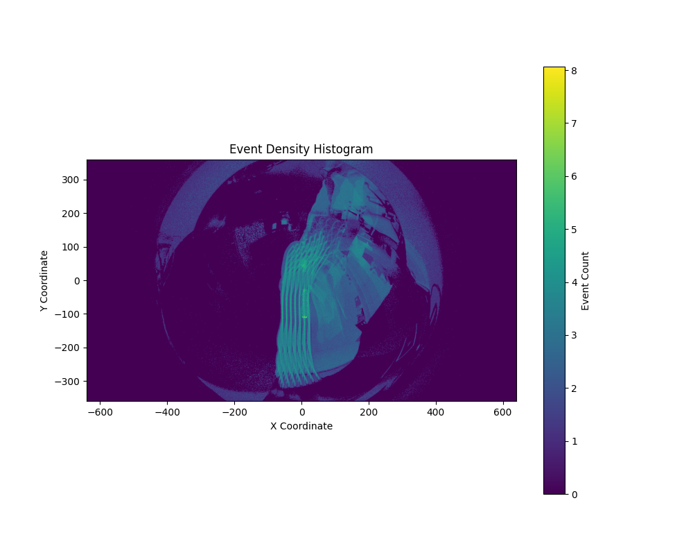
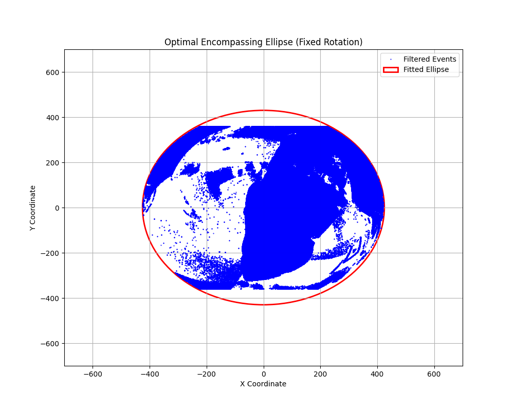
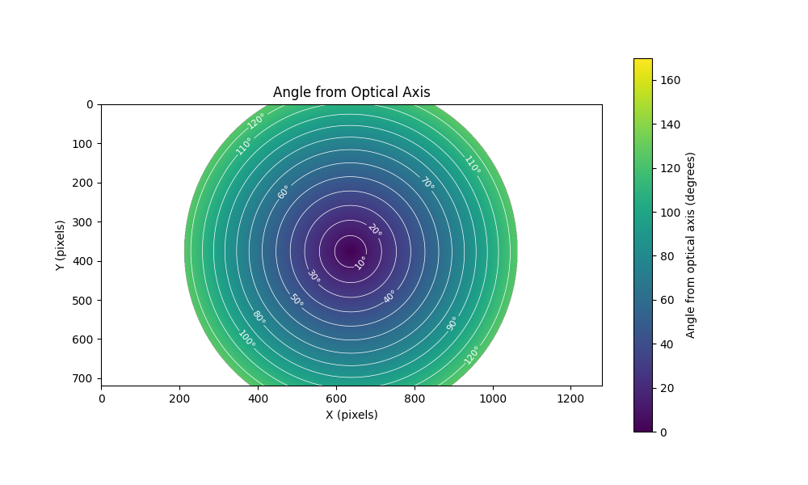

# Metavision py-OCamCalib

A set of scripts to calibrate a Prophesee Event based camera using py-OCamCalib

## Installation

This collection of scripts should allow for easier calibration pipeline of Prophesee Event based cameras using the py-OCamCalib library.
It should also allow calibration of cameras, which use LED-lattice patterns for calibration, where blob detectors estimate centers of the LED grid points.

Clone the repository:

```bash
git clone git@github.com:kubakubakuba/metavision-pyocamcalib.git
```

Requirements:
- Python 3.10
- my fork of [py-OCamCalib](https://github.com/kubakubakuba/py-OCamCalib), original is [here](https://github.com/jakarto3d/py-OCamCalib)
- [Metavision SDK](https://docs.prophesee.ai/stable/installation/index.html) when working with event cameras from Prophesee

Pip packages:
- numpy
- opencv-python
- matplotlib
- toml / tomllib (based on you version of python)
- typer

It is best to install the packages in a virtual environment. You can do so by:

```bash
python3.10 -m venv .venv
source .venv/bin/activate
pip install numpy opencv-python matplotlib toml typer
```

To install the py-OCamCalib in the venv:

```bash
cd py-OCamCalib
python setup.py install
```

## Usage

### Frame generation

First, you need to generate frames from your camera recording. You can either do this by using Metavision Studio by exporting an `.avi`, then dumping the image
frames by using something like `ffmpeg`. Or you can use the `interactive_framegen.py` script to generate frames from a recording.

The script loads the recording to an interactive window, where you can generate frames with variable exposure times at specific timestamps (and with cutoff points).

```bash
python3.10 interactive_framegen.py INPUT_FILE OUTPUT_FOLDER [--start-time-us] [--accumulation-time-us] [--threshold] 
```


Eached frame is saved in the output folder under the name `frame_{random hex}.png`.

### Calibration point alignment

After generating the frames, you can use the `detect_blob_centers.py` script to autodetect the calibration points of all frames in a folder.

```bash
python3.10 detect_blob_centers.py FOLDER OUTPUT_TOML [--no-detect]
```

You can configure the number of LEDs in the calibration lattice in `Config` object in `config.py`.

which will detect the blobs of frames on the frames in the folder, and save all the positions to a `.toml` file. ~~The `--color` flag can be configured to either `both` (default), `positive` or `negative` to only detect one color of the blobs.~~ (not used since the detections now happen on grayscale images). The `--no-detect` flag can be used to skip the detection.

Blobs can be added manually, by pressing `n` to add a new blob, `r` to reset the labeling and detection. Press `x` to remove the closes blob to the mouse cursor. Press `o` to order the blob centers to the grid (not working well yet, look in [sort_blobs.py](https://github.com/kubakubakuba/metavision-pyocamcalib/blob/main/sort_blobs.py) at the implementation of the sorting).

Press `c` to continue to the next frame after you have selected all blobs. 

You need to click on all the points in the frame in the same order on all of the frames in order for the calibration to work (from top left corner by rows).


After all images have been labeled, the script will save the positions to the output `.toml` file.

```toml
[[images]]
path = "calibration/frame_3eb5EC47.png"
[[images.points]]

[images.points.image_coordinates]
x = 129
y = 188
[images.points.world_coordinates]
x = 0
y = 0
```

This file needs to be converted to a python `pickle` of a format, that `py-OCamCalib` can read. This can be done by running the `convert_to_checkpoint.py` script.

```bash
python convert_to_checkpoint.py INPUT_TOML OUTPUT_PICKLE
```

### Calibration

You now need to run the calibration script to calibrate the camera. This is either located in `src/pyocamcalib/script/calibration_script.py` (where you installed py-OCamCalib), and pass the detections as a parameter.
Or you can use the `calib.py` script in this directory directly.

```bash
python3.10 calib.py IMAGE_DIR NUM_ROWS NUM_COLS --corners-path detections.pickle --check --camera-name NAME --fname CALIBRATION_FILENAME --max-degree MAX_POLY_DEGREE --working-dir WORK_DIR
```

### Fitting an ellipse

To fit an ellipse to the recording, run the `fit_ellipse.py` script. Change the source `raw` file and the initial guess for the ellipse parameters.





### Visualization

You can then visualize the calibrated lens parameters by running the `viz.py` script (with a calibration file present as `calibration.json` and correct
ellipse parameters from the `fit_ellipse.py` script):



