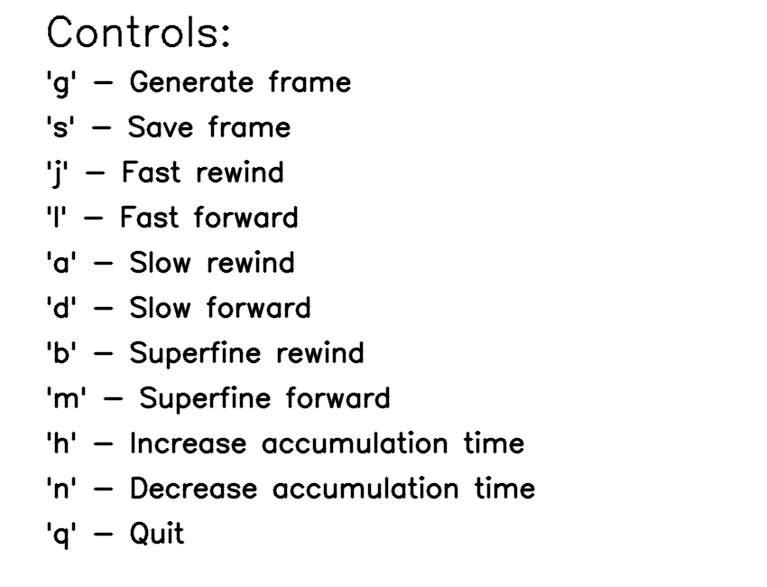
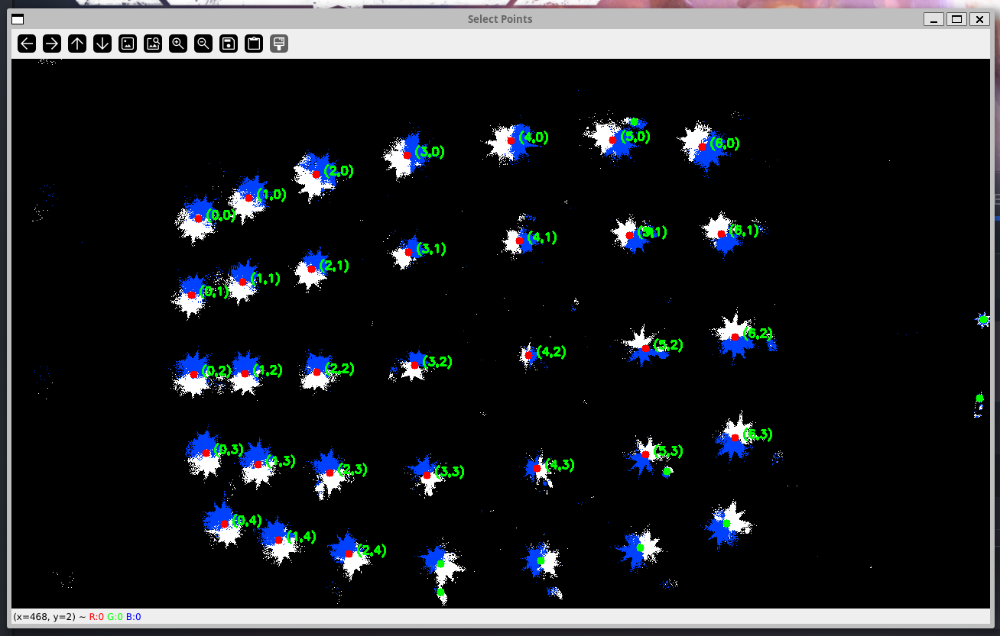
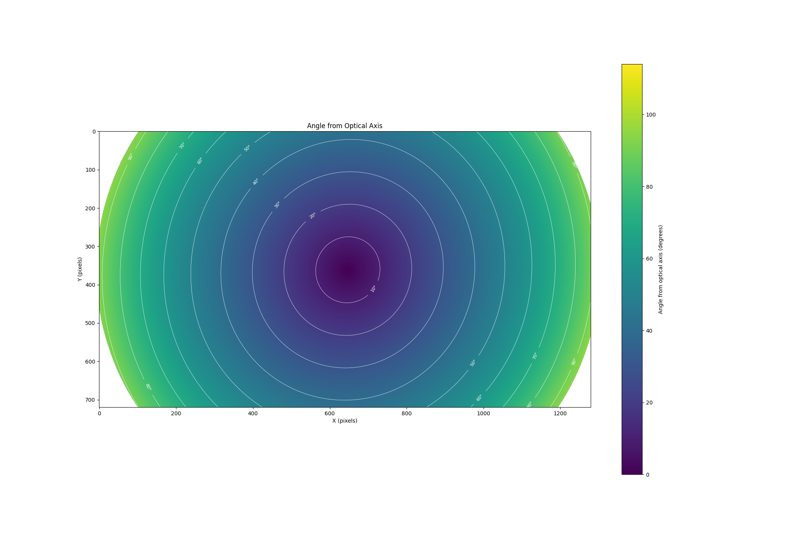

# Metavision py-OCamCalib

A set of scripts to calibrate a Prophesee Event based camera using py-OCamCalib

## Installation

This collection of scripts should allow for easier calibration pipeline of Prophesee Event based cameras using the py-OCamCalib library.

Requirements:
- Python 3.10
- [py-OCamCalib](https://github.com/jakarto3d/py-OCamCalib)
- [Metavision SDK](https://docs.prophesee.ai/stable/installation/index.html)

Pip packages:
- numpy
- opencv-python
- matplotlib
- toml / tomllib (based on you version of python)
- typer

## Usage

### Frame generation

First, you need to generate frames from your camera recording. You can either do this by using Metavision Studio by exporting an `.avi`, then dumping the image
frames by using something like `ffmpeg`. Or you can use the `interactive_framegen.py` script to generate frames from a recording.

The script loads the recording to an interactive window, where you can generate frames with variable exposure times at specific timestamps (and with cutoff points).



```bash
python3.10 interactive_framegen.py INPUT_FILE OUTPUT_FOLDER [--start-time-us] [--accumulation-time-us] [--threshold] 
```

Eached saved framed is saved in the output folder under the name `frame_{random hex}.png`.

### Calibration point alignment

After generating the frames, you can use the `detect_blob_centers.py` script to autodetect the calibration points of all frames in a folder.

```bash
python3.10 detect_blob_centers.py FOLDER OUTPUT_TOML [--color] [--no-detect]
```

You can configure the number of LEDs in the calibration lattice in `Config` object in `config.py`.

which will detect the blobs of frames on the frames in the folder, and save all the positions to a `.toml` file. The `--color` flag can be configured to either `both` (default), `positive` or `negative` to only detect one color of the blobs. The `--no-detect` flag can be used to skip the detection.

Blobs can be added manually, by pressing `n` to add a new blob, `r` to reset the labeling and detection. Press `c` to continue to the next frame after you have selected all blobs. 

You need to click on all the points in the frame in the same order on all of the frames in order for the calibration to work (from top left corner by rows).



After all images have been labeled, the script will save the positions to the output `.toml` file.

```toml
[[images]]
path = "calibration/frame_3eb5EC47.png"
[[images.points]]

[images.points.image_coordinates]
x = 129
y = 188
[images.points.world_coordinates]
x = 0
y = 0
```

This file needs to be converted to a python `pickle` of a format, that `py-OCamCalib` can read. This can be done by running the `convert_to_checkpoint.py` script.

```bash
python convert_to_checkpoint.py INPUT_TOML OUTPUT_PICKLE
```

### Calibration

You now need to run the calibration script to calibrate the camera. This is located in `src/pyocamcalib/script/calibration_script.py`, and pass the detections as a parameter.

```bash
cd src/pyocamcalib/scripts
python3.10 calibration_script.py IMAGE_DIR NUM_ROWS NUM_COLS --corners-path detections.pickle --check --camera-name NAME
```

### Visualization

You can then visualize the calibrated lens parameters by running the `viz.py` script (with a calibration file present as `calibration.json`):

